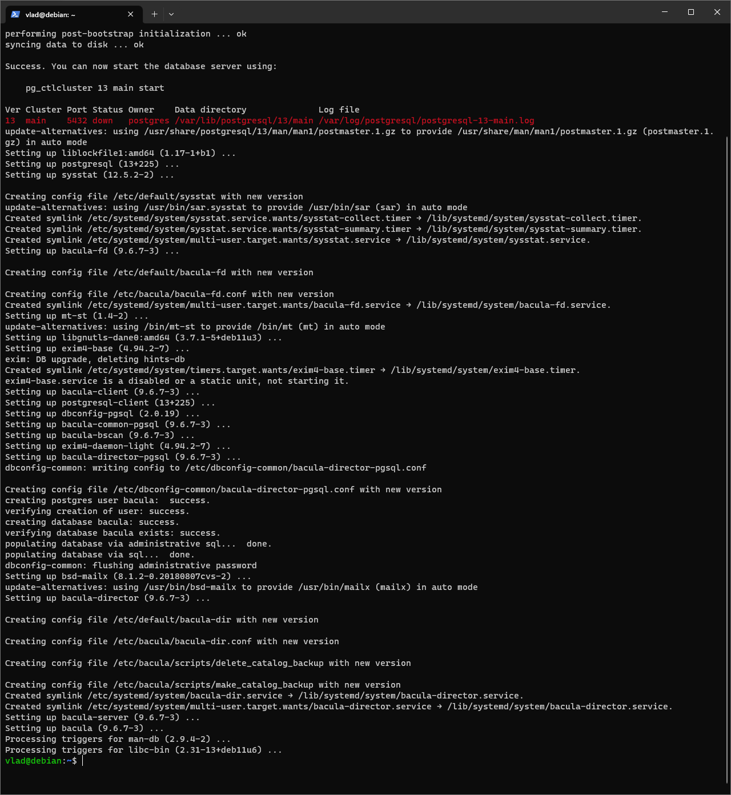
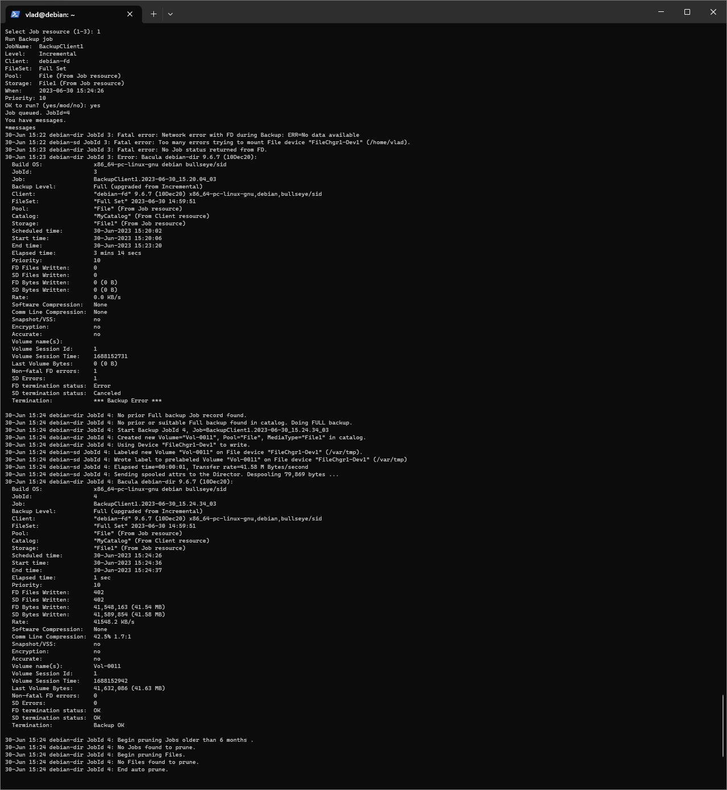

# "Reserv-copy" | "Бойко Владислав"
---
## Задание 1
Если прям кратко то точка старта каждого нового бекапа, это и есть основное отличие: 
* при full backup точка старта - 0, т.е. каждый раз происходит полный бэкап системы с нуля.
* при дифференциальном первый бекап подобен fullbackup, но каждый последующий бекапит лишь изменившиеся файлы беря за точку отчета самый первый бекап
* при инкрементном происходит похожий с дифференциальным процесс, но точкой отчта для нового бекапа будит всегда самый последний бекап.
---
## Задание 2
Установил:

получается работает

В папочке conf.file конфиги
---
## 
---
## 
---
## 
---
## 
---